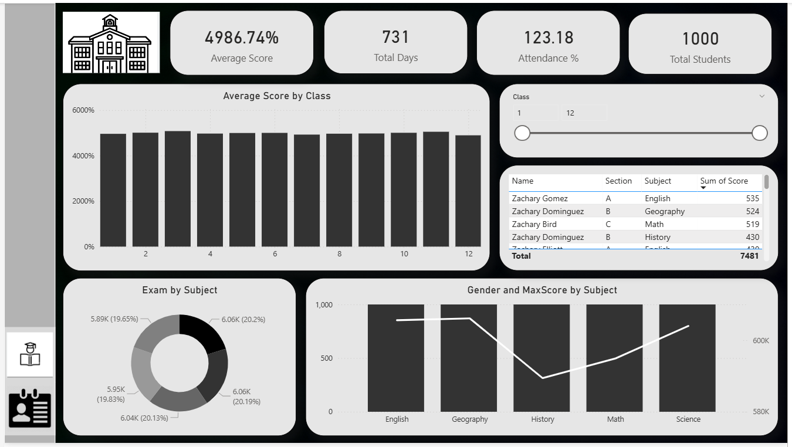
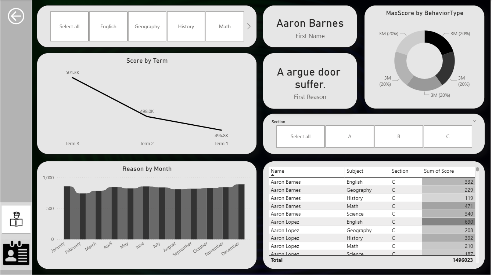

# 📊 Student Performance & Behavior Analysis – Power BI Project

---

## 🔍 Project Overview
This project is a **Power BI practical dashboard** created to analyze **student academic performance, attendance, and behavior** using multiple datasets.

The main objective of this project is to:
- 📚 Analyze subject-wise student scores
- 🏫 Track attendance trends
- 🧠 Understand student behavior patterns
- 📊 Provide interactive insights for teachers and management

The dashboard is **interactive, dynamic, and visually attractive**, making data analysis easy and effective.

---

## 📂 Datasets Used
The following Excel datasets are used in this project:

| Dataset Name | Description |
|-------------|------------|
| Students.xlsx | Student basic details (StudentID, Class, Section) |
| Scores.xlsx | Subject-wise marks and maximum score |
| Attendance.xlsx | Student attendance percentage |
| Behavior.xlsx | Student behavior categories |

---

## 🔗 Dataset Links
(All datasets are attached in the same project folder)

-  [Students.xlsx](./Students.xlsx)
-  [Scores.xlsx](./Scores.xlsx)
-  [Attendance.xlsx](./Attendance.xlsx)
-  [Behavior.xlsx](./Behavior.xlsx)

---

## 🧹 Data Cleaning & Modeling
The following steps were performed in Power BI:

- Imported all Excel datasets
- Created relationships using **StudentID**
- Cleaned column names for consistency
- Corrected data types (numeric, text, percentage)
- Handled missing and null values
- Built a clean and optimized data model

---

## 🧮 DAX Measures Created
Important DAX measures used in this project include:

- **% Score** = Score / MaxScore
- **Average Score per Subject**
- **Attendance %**
- **Behavior Count per Type**
- **Performance Category**
  - High
  - Medium
  - Low  
  *(Based on average % score using IF / SWITCH)*

---

## 📊 Visualizations Used
The Power BI dashboard contains the following visuals:

- 📊 **Bar Chart** – Average scores by Subject & Class
- 📈 **Line Chart** – Performance trend by Term
- 🍩 **Donut Chart** – Behavior type distribution
- 📋 **Table Visual** – Student-wise scores  
  - Conditional formatting:
    - 🟢 Green → Score above 80%
    - 🔴 Red → Score below 40%
- 🧾 **KPI Cards**
  - Total Students
  - Average Attendance
  - Average Score

---

## 🎯 Interactivity Features
To make the dashboard user-friendly and interactive:

- Slicers for Class, Section, Subject, and Term
- Drillthrough page for individual student profile
- Tooltips for additional insights
- Bookmark navigation:
  - Academic View
  - Behavioral View

---

## 🖼️ Dashboard Screenshots
Dashboard screenshots are attached for reference:

- 📸 **Screenshot 1 – Dashboard Overview**  

  

- 📸 **Screenshot 2 – Student Performance Analysis**  

  

---

## 📱 Mobile View
A mobile-optimized layout is also designed to ensure smooth viewing on the **Power BI Mobile App**.

---

## 📦 Project Deliverables
- ✅ Power BI Dashboard (.pbix)
- ✅ Excel Datasets
- ✅ Interactive Visuals
- ✅ DAX Measures
- ✅ README.md Documentation

---

## 🚀 Conclusion
This project represents a complete **end-to-end Power BI analytics solution**, covering:
- Data cleaning and preparation
- Data modeling
- DAX calculations
- Interactive dashboard creation

It is ideal for **Power BI practical exams, GitHub portfolio, and real-world analytics projects**.

---
## 👤 Author
**Created By:** Janki Dholariya  
**Tool Used:** Power BI Desktop  
**Project Type:** Academic / Practical Assignment  